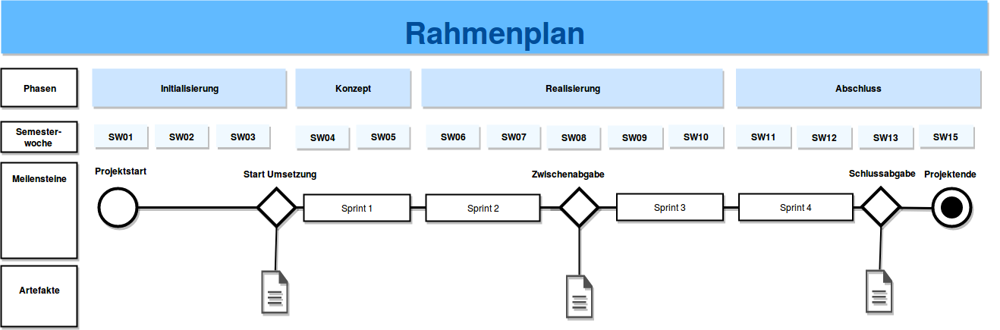

# Projektorganisation

## Organisationsplan

{#organigramm width=50%}

## Rollen

- Projektleiter: _Sascha Sägesser_
- Interfacekomitee: _Patrick Bucher_
- Product Owner: _Fabian Meyer_
- Scrum Master: _Pascal Kiser_

## Zuständigkeit

- Dokumentation: _Patrick Bucher_
- Build: _Pascal Kiser_
- Testing: _Fabian Meyer_
- Codereview: _Patrick Bucher_
- Sprintreviews: _Sascha Sägesser_
- Meilensteinberichte: _Fabian Meyer_
- Risikomanagement: _Pascal Kiser_

# Projektführung

## Rahmenplan

Der Rahmenplan (siehe Abbildung [Rahmenplan](#rahmenplan)) stellt eine Übersicht auf abstrakter Ebene dar. Die wichtigsten Elemente sind die definierten Meilensteine und Sprints. Dabei ist darauf zu achten, dass die Vorgaben der Aufgabenstellung, wie z.B. die Zwischen- und Schlussabgabe, von Anfang an in das Projekt miteingeplant werden.

{#rahmenplan}

## Meilensteinplan

Das komplette Projekt ist in drei Meilensteine aufgeteilt. Der erste Meilenstein entspricht dem Start der Projektumsetzung und die beiden letzten Meilensteine ergeben sich aus der Zwischen- und Schlussabgabe. Zu jedem Meilenstein gibt es Deliverables:

1. **Meilenstein (Start Umsetzung, 12.03.2018)**
    - ProductBacklog
    - Sprintplanung S1/S2
    - Detailplanung S1
2. **Meilenstein (Zwischenabgabe, 08.04.2018)**
    - Release 1 gemäss Muss-Features deployed und lauffähig
    - Sprintplanung S3/S4
3. **Meilenstein (Schlussabgabe, 13.05.2018)**
    - Release 2 gemäss Muss-Features deployed und lauffähig

## Sprintplan

Die Projektdurchführung (MS 2 / 3) ist in vier Sprints aufgeteilt. Für die einzelnen Sprints sind Endtermin und Deliverables wie folgt festgelegt:

1. Sprint (25.03.2018): Sprintreview S1, Sprintplanung S2
2. Sprint (08.04.2018): Sprintreview S2, Sprintplanung S3
3. Sprint (29.04.2018): Sprintreview S3, Sprintplanung S4
4. Sprint (13.05.2018): Sprintreview S4

Jeder Sprint dauert zwei Wochen. Die detaillierte Sprintplanung ist mittels des Online-Tools [ScrumDo](https://app.scrumdo.com/projects/vsk-18fs-t05/#/summary) realisiert.

## Projektstrukturplan

Um das Projekt besser planen, durchzuführen und kontrollieren zu können, ist dieses in mehrere Teilprojekte, welche wiederum in Teilaufgaben gegliedert sind, aufgeteilt (siehe Abbildung [Projektstrukturplan](#projektstrukturplan)).

{#projektstrukturplan width=80%}

## Risikomanagement

### Krankheits- / unfallbedingte Ausfälle

Eine oder mehrere Personen fallen im Verlauf des Projekts krankheitsbedingt oder aufgrund eines Unfalles aus.

Folgende Massnahmen wurden definert, um das Schadensausmass und die Eintreffenswahrscheinlichkeit zu reduzieren:

**Reduktion Schadensausmass:**

* Wissensaustausch zwischen den Gruppenmitgliedern
* Dokumentation pflegen
* Regelmässiger Austausch im Plenum

**Reduktion Eintreffenswahrscheinlichkeit:**

* Keine Extremsportarten während den Sprints
* gesunde Ernährung

### Ausfall HSLU-Netz

HSLU-Netz, EnterpriseLab oder andere verwendete Infrastruktur fallen aus oder können aus anderen Gründen nicht mehr verwendet werden.

Die Eintreffenswahrscheinlichkeit kann von den Gruppenmitgliedern mit beeinflusst werden. Folgende Massnahmen wurden definert, um das Schadensausmass reduzieren:

**Reduktion Schadensausmass:**

* Dokumentation und Sourcecode wird lokal von den einzelnen Gruppenmitgliedern gesichert
* Ausweichmöglichkeiten definiert (beispielsweise GitHub bei Ausfall von Enterpriselab/Gitlab)
* Die Dokumentation des Projekts wird unabhängig vom Sourcecode verwaltet

### Hardwareausfall / Verlust privater Arbeitsgeräte

Geleistete Arbeit geht verloren durch Ausfall oder den Verlust verwendeter Arbeitsgeräte.

Folgende Massnahmen wurden definert, um das Schadensausmass und die Eintreffenswahrscheinlichkeit zu reduzieren:

**Reduktion Schadensausmass:**

* Versionsverwaltung (Git)
* Instruktion Gruppenmitglieder: regelmässiges Commiten/Pushen

**Reduktion Eintreffenswahrscheinlichkeit:**

* Eigenverantwortung Gruppenmitglieder
* Keine lokalen Dateien; alle relevanten Dateien zum Projekt werden extern gehostet (Gitlab, Github etc).

### Zeitknappheit

Zeitknappheit aufgrund schlechter oder fehlender Planung.

Folgende Massnahmen wurden definert, um das Schadensausmass und die Eintreffenswahrscheinlichkeit zu reduzieren:

**Reduktion Schadensausmass:**

* Priorisierung von Features
* Minimalanforderungen definieren

**Reduktion Eintreffenswahrscheinlichkeit:**

* Angemessene Zeitplanung
* Regelmässige Kontrolle, klar definierte Verantwortlichkeiten

## Projektkontrolle

Für die Projektkontrolle sind folgende Tools und Methoden im Einsatz:

- ScrumDo
- ProductBacklog
- SprintBacklog
- Backlog-Grooming
- Definierung von Definition of Done der Tasks
- Sprintreviews

## Aufwandschätzung

Es wird davon ausgegangen, dass pro Person und Woche, zusätzlich zu den Vorlesungen, 5 Stunden Aufwand hinzukommen.
Insgesamt entsteht so ein geschätzter Aufwand von 40 Stunden pro Sprint, respektive 80 Stunden jeweils für die Zwischen- und Schlussabgabe.

Der Aufwand wird weiterhin in folgende Kategorien unterteilt:

- **Scrum:** Backlog Grooming, Projektkontrolle
- **Entwicklung:** Entwicklung der Software
- **Testing:** Testfälle schreiben und Tests durchführen
- **Reviewing:** Software, Tests und generell Sprint mit jeweils 2+ Gruppenmitgliedern reviewen
- **Dokumentation:** Verfassen sämtlicher Dokumente (ohne Sprintviews)

Zu beachten ist, dass die nachfolgenden Werte grobe Schätzungen darstellen und aufgrund mangelnder Erfahrung stark vom tatsächlichen Wert abweichen können. Der wesentlich genauer geschätzte und benötigte Aufwand der Entwicklung und des Testings sind den Sprintreviews des Dokuments *Scrum.pdf* zu entnehmen.

### Zwischenabgabe

Für die Zwischenabgabe besteht keine detaillierte Aufwandschätzung.

### Schlussabgabe

- **Scrum:** 8h
- **Entwicklung:** 37h
- **Testing:** 15h
- **Reviewing:** 5h
- **Dokumentation:** 15h

## Definition of Done

Um gruppenintern klarstellen zu können, wann ein Task als erfüllt gilt, sind mehrere *Definition of Done* definiert worden.

- Funktionalität vom Product Owner abgenommen
- Code-Review von mindestens einem Teammitglied durchgeführt
- Bestehende Tests erfolgreich durchgelaufen
- Eingeführte Features sind in der Projektdokumentation vermerkt
- Änderungen in GitLab eingecheckt
- Build auf Jenkins funktioniert

# Projektunterstützung

## Tools für Entwicklung, Test & Abnahme

Für das **Projektmanagement** sind folgende Tools im Einsatz:

| Bereich                | Tool                                                       |
|------------------------|------------------------------------------------------------|
| Vorgehensmodell: Scrum | ScrumDo                                                    |
| Datenaustausch         | `git`, GitHub                                              |
| Dokumentation          | Markdown, Pandoc, Microsoft Office 2016, draw.io, plantuml |

Für die **Entwicklung** sind folgende Tools im Einsatz:

| Bereich                | Tool                                  |
| ---------------------- | ------------------------------------- |
| Entwicklungsumgebung   | ItelliJ IDEA 2017                     |
| Programmiersprache     | Java 1.8                              |
| Versionskontrolle      | git, GitLab                           |
| Testing                | JUnit, Integrationstests, Systemtests |
| Build                  | Maven, `make`                         |
| Continuous Integration | Jenkins                               |

## Konfigurationsmanagement

Das Konfigurationsmanagement soll die Einhaltung von Regeln für einen organisatiorischen und verhaltensmässigen Lebenslauf eines Produkts und seiner Configuration Items (Konfigurationseinheiten) gewährleisten.

Ein Configuration Item ist eine beliebige Kombination aus Hardware, Software und / oder Dienstleistung. In diesem Projekt sind das die Dokumentationen, Komponenten und Interfaces. Im Kapitel *Releasemanagement* sind eben erwähnte ausführlich aufgelistet.

## Releasemanagement

Das Releasemanagement befasst sich mit der Planung und Durchführung der Veröffentlichung. Dieses Projekt beinhaltet zwei Releases:

- Release 1: Zwischenabgabe (SW08)
- Release 2: Schlussgabe (SW13)

Zur verbesserten Lesbarkeit sind die Configuration Items in *Dokumentation* und *Software* aufgeteilt.

### Dokumentation

| Configuration Item    | Release 1      | Release 2      |
| --------------------- | -------------- | -------------- |
| Projektmanagementplan | 1.0.0          | 2.0.0          |
| Systemspezifikation   | 1.0.0          | 2.0.0          |
| TCP-Schnittstelle     | 1.0.0          | 2.0.0          |
| Testplan              | 1.0.0          | 2.0.0          |
| Scrum-Dokumentation   | 1.0.0          | 2.0.0          |

### Software

| Configuration Item    | Release 1      | Release 2      |
| --------------------- | -------------- | -------------- |
| Logger                | 1.0.0-SNAPSHOT | 1.0.0-SNAPSHOT |
| LoggerSetup           | 1.0.0-SNAPSHOT | 1.0.0-SNAPSHOT |
| LoggerCommon          | 1.0.0-SNAPSHOT | 1.0.0-SNAPSHOT |
| LoggerComponent       | 1.0.0-SNAPSHOT | 1.0.0-SNAPSHOT |
| LoggerServer          | 1.0.0-SNAPSHOT | 1.0.0-SNAPSHOT |
| LoggerViewer          |                | 1.0.0-SNAPSHOT |
| StringPersistor       | 4.0.1          | 4.0.1          |
| StringPersistorFile   | 1.0.0-SNAPSHOT | 1.0.0-SNAPSHOT |
| GameOfLife            | 1.0.0-SNAPSHOT | 1.0.0-SNAPSHOT |
