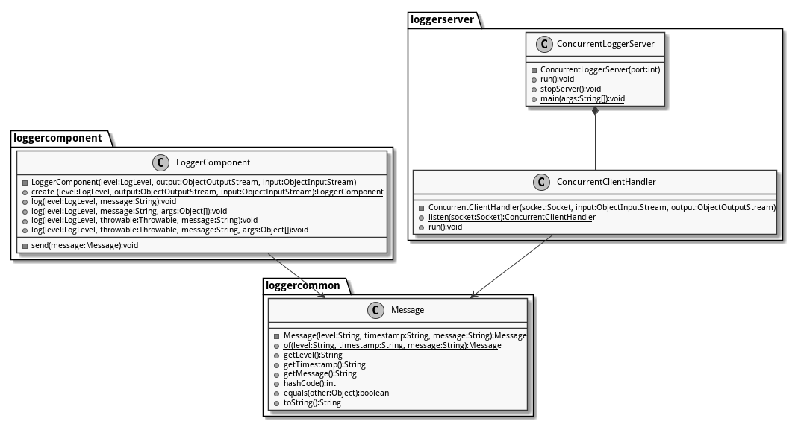
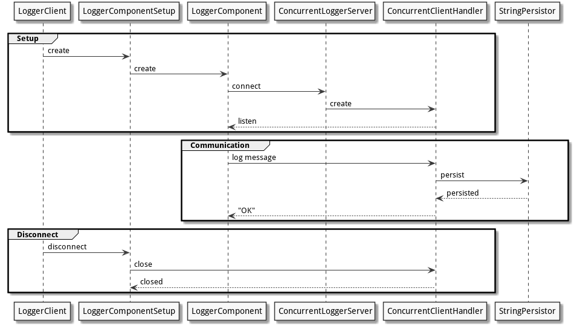

# Protokoll

Die Kommunikationsschnittstelle zwischen `logger-component` und `logger-server` ist mit TCP umgesetzt. Lognachrichten sind als Klasse `Message` (aus dem `logger-common`-Projekt) umgesetzt. Diese Klasse ist beiden Seiten -- Client und Server -- bekannt und serialisierbar. Sie besteht aus drei `String`-Attributen: `level` (`LogLevel.name()`), `timestamp` (mittels `DateTimeFormatter.ISO_DATE_TIME` formatierter Zeitpunkt) und `message` -- der eigentlichen Lognachricht.

Die Client-Server-Kommunikation besteht darin, Instanzen der Klasse `Message` vom Client auf den Server zu übertragen, wo sie mittels `StringPersistor` festgehalten werden. Eingehende Lognachrichten werden auf dem Server mit dem String `"OK"` quittiert. Bleibt diese Antwort aus, wird dies clientseitig über die Konsole gemeldet. (Für die Schlussabgabe wird das Protokoll dahingehend erweitert, dass der Client unquittierte Meldungen in einer lokalen Warteschlange behält und diese -- evtl. nach wiederhergestellter Verbindung zum Server -- erneut zu senden versucht.)

{width=50%}

## Alternativen

Zwar gibt es mit RMI und HTTP komfortablere und stabilere Protokolle als «blankes» TCP, diese haben aber einen grösseren Overhead und benötigen zusätzliche Komponenten: bei RMI spezielle Stub-Klassen, bei HTTP einen Webserver, der das entsprechende Protokoll «spricht». Da die Implementierung mittels TCP auf Anhieb und problemlos funktioniert hat, gab es keinen Grund auf ein schwergewichtigeres Protokoll mit entsprechendem Overhead zu wechseln. Das gewählte einfache und leichtgewichtige Protokoll dürfte auch bei den anstehenden Lasttests von Vorteil sein.

# Server

Der Server wird mit der Klasse `ConcurrentLoggerServer` (`logger-server`) umgesetzt. Der Port, auf den der Server hören soll, kann per Konstruktor übergeben werden. Derzeit wird er über die Konstante `DEFAULT_PORT` mit dem Wert `1234` belegt. (Für mehr Flexibilität könnte diese Einstellung in einer späteren Version auch per Kommandozeilenparameter oder Logdatei gesetzt werden.) Sobald der `ServerSocket` and den jeweiligen Port gebunden ist, nimmt er Verbindungen entgegen.

## Handhabung mehrerer Clients

Für jede eingegangene Verbindung wird ein neuer `ConcurrentClientHandler` erstellt. Diese Klasse implementiert das Interface `Runnable`, sodass jeder Client in einem eigenen Thread bedient werden kann. Der Client-Handler dekoriert den `OutputStream` und den `InputStream` des Client-Sockets mit einem `ObjectOutputStream` bzw. einem `ObjectInputStream`, sodass er Objekte senden und empfangen kann. In der `run()`-Methode werden Objekte in einer Endlosschleife vom Socket entgegengenommen, zu einer `Message` gecastet und über den `StringPersistorAdapter` gespeichert. Nach der Speicherung wird der Eingang der Meldung mit dem String `"OK"` quittiert.

Wird der Socket clientseitig geschlossen, tritt beim Versuch ein Objekt vom Socket zu lesen eine `EOFException` auf. Die `run()`-Methode wird in diesem Fall mittels `return`-Anweisung beendet, sodass der jeweilige Thread endet. Eine Verbindung kann nur clientseitig geschlossen werden.

# Client

Der clientseitige TCP-Code ist in der Klasse `LoggerComponent` umgesetzt. Die Verbindung zum Server wird in der Klasse `LoggerComponentSetup` verwaltet, sodass `LoggerComponent` bei der Instanzierung eine Referenz auf den Socket erhält. (Ändert sich die Konfiguration auf `LoggerComponentSetup`, wird die Verbindung entsprechend neu aufgebaut.) 

`LoggerComponent` implementiert vier verschiedene `log`-Methoden: für eine «blanke» Meldung, für eine formatierte Meldung mit Parametern, für eine Meldung mit `Throwable` und schliesslich für eine Kombination aller erwähnten Elemente. Jede dieser Methoden erstellt aus den gegebenen Parametern eine `Message`-Instanz. Diese wird an die `send`-Methode weitergegeben, welche diese über den `ObjectOutputStream` an den Server schickt und anschliessend blockierend auf das `"OK"` des Servers wartet. (Auf diese Weise geht immer nur höchstens eine Meldung «verloren», die jedoch clientseitigen weiter als Objekt im Gültigkeitsbereich der `send()`-Methode verfügbar ist und später erneut gesendet werden könnte.)

Die Konfiguration des Clients erfolgt über die Konfigurationsdatei `config.xml`, welche unter anderem die Koordinaten des Servers (Hostname und Portnummer) enthält. (Die Klasse `Logging` im `game`-Projekt kapselt das Auslesen der Konfiguration und die Erstellung der `LoggerComponentSetup`-Instanz.)

# Schwierigkeiten

## Bestätigung der Meldung

Die TCP-Kommunikation wurde zunächst händisch getestet, indem ein Logger-Client Meldungen übertragen hat, deren Eintreffen serverseitig in der entsprechenden Logdatei mittels `tail -f` laufend überprüft wurde. Beim späteren Schreiben von Unit- und Integration-Tests musste eine neue Lösung gesucht werden, da das Ankommen einer Meldung, die nach dem «Fire and Forget»-Prinzip abgeschickt wurde, nicht (bzw. nur sehr umständlich) anhand der Logdatei geprüft werden konnte. Aus diesem Grund wurde die Rückmeldung mit `"OK"` nachträglich eingeführt um Gewissheit über das Eintreffen der Meldungen zu bekommen.

## Abweichendes Verhalten beim Mocking

Beim `LoggerComponentTest`, bei dem die Socketkommunikation über den `PipeInputStream` und den `PipeOutputStream` simuliert wird, tritt sofort eine `EOFException` auf, wenn `LoggerComponent` die `"OK"`-Rückmeldung erfolglos zu lesen versucht. Aus diesem Grund muss in diesem Test die `"OK"`-Rückmeldung bereits vor dem Log-Aufruf in die Pipe geschrieben werden -- die Logmeldung im Voraus quittiert werden. (In diesem Test geht es um die Filterung und Formatierung der Logmeldungen, nicht um die Netzwerkkommunikation. Ein solcher Workaround ist somit vertretbar, zeigt aber die Grenze des gewählten Mocking-Ansatzes auf.)

# Überblick

## Klassendiagramm

{width=90%}

## Sequenzdiagramm

{width=90%}
