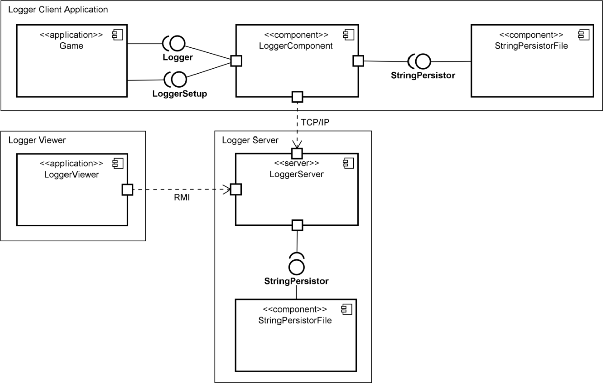
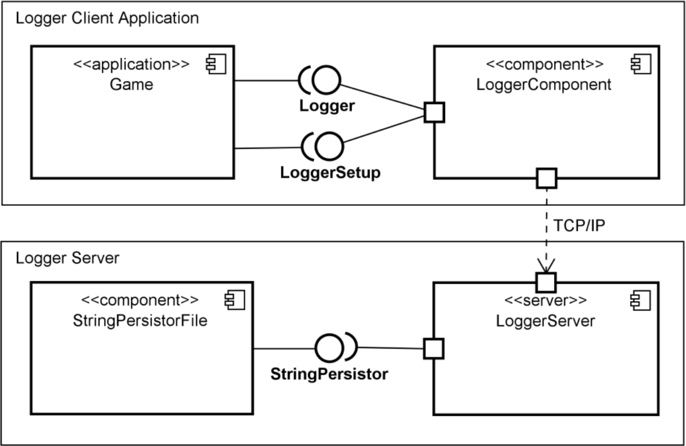
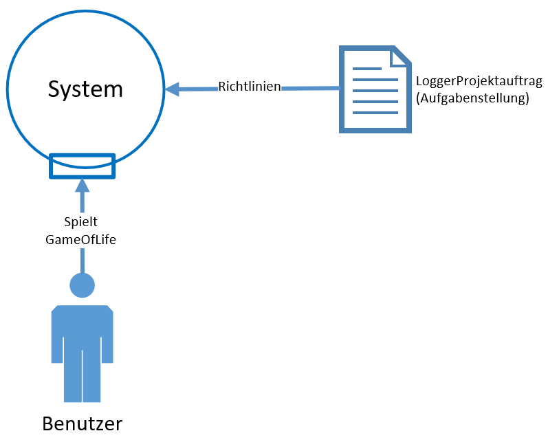
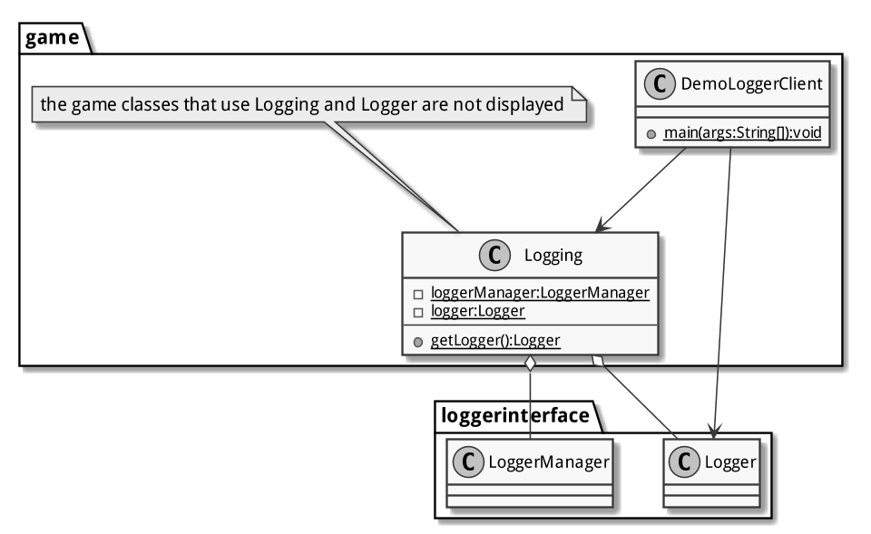
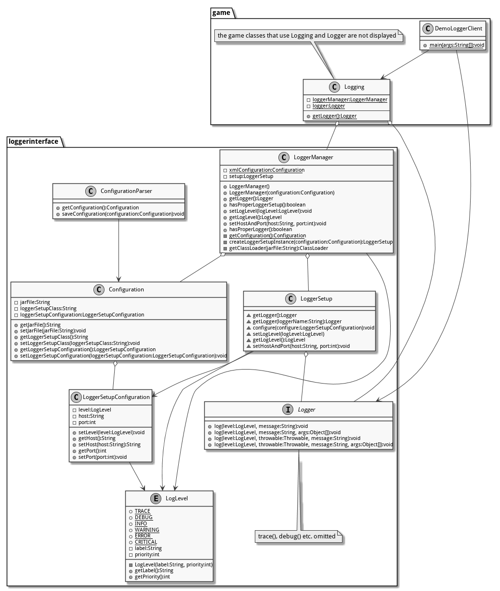
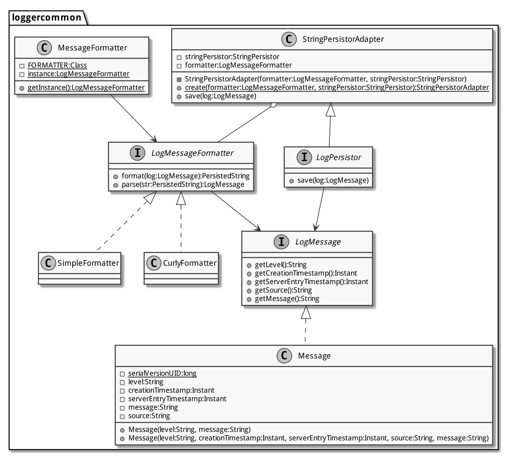
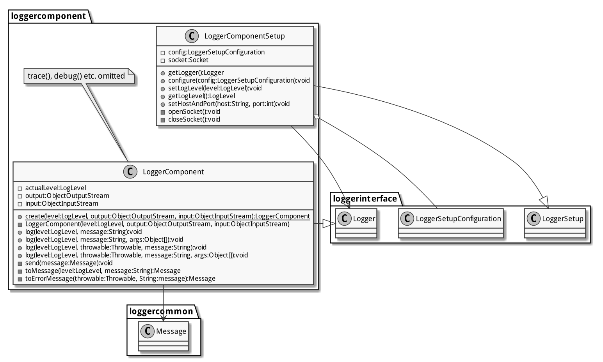
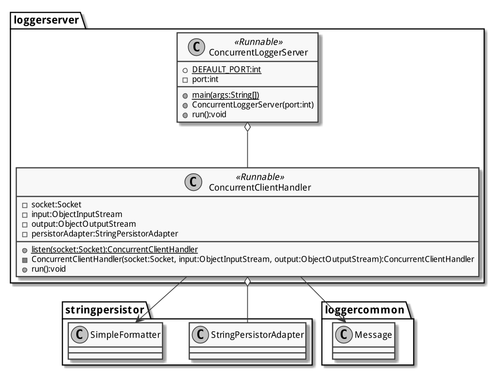
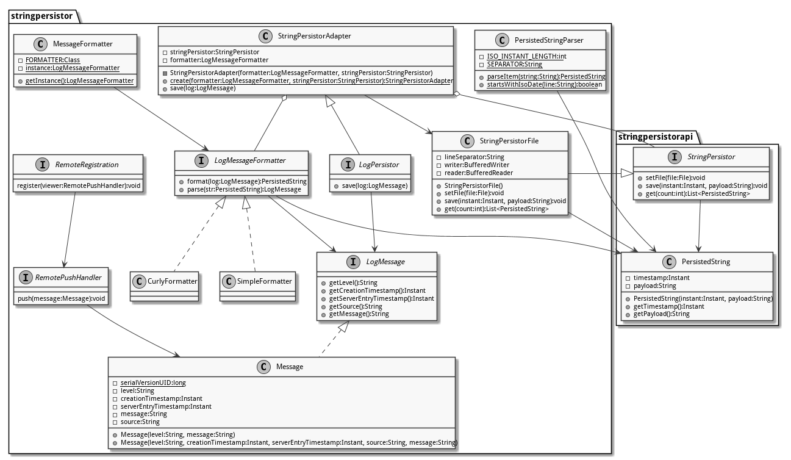
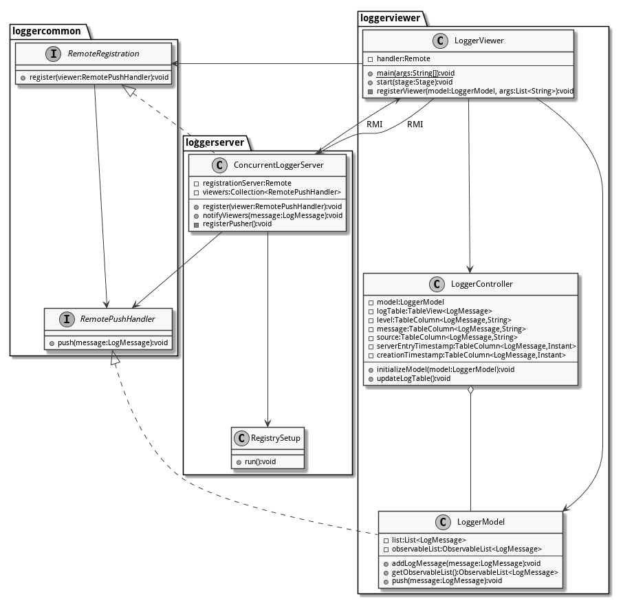

# Systemübersicht

Die Systemarchitektur ist grösstenteils durch den Projektauftrag festgelegt. Dieses ist in der Abbildung [Komponentendiagramm Projektauftrag](#systemarchitektur) ersichtlich. Die Anwendung besteht aus zwei Bereichen: Dem Client und dem Server. Das _Game_ kommuniziert mittels _Logger_- und _LoggerSetup_-Schnittstelle mit der _LoggerComponent_. Diese schlägt die Brücke zum Server-Bereich über ein TCP/IP-Protokoll, worüber sie mit dem _LoggerServer_ kommuniziert. (Dieses Protokoll ist implementierungsspezifisch und bei der Gruppe 5 im Dokument _TCP-Schnittstelle_ dokumentiert.) Der _LoggerServer_ macht Gebrauch von einer Komponente namens _StringPersistorFile_, mit welcher er über die _StringPersistor_-Schnittstelle kommuniziert.

{#systemarchitektur}

## Implementierungsspezifische Komponentenarchitektur

Die Abbildung [Komponentendiagramm](#komponentendiagramm) gibt das Komponentendiagramm aus dem Projektauftrag leicht verändert wieder, indem es dem Umstand Rechnung trägt, dass der _LoggerServer_  und die Komponente _StringPersistorFile_ nicht direkt über die _StringPersistor_-Schnittstelle, sondern per _LogPersistor_-Schnittstelle über den _StringPersistorAdapter_ und die _StringPersistor_-Schnittstelle miteinander kommunizieren.

{#komponentendiagramm width=80%}

## Kontextdiagramm

{#kontextdiagramm width=80%}

Die Abbildung [Kontextdiagramm](#kontextdiagramm) bietet einen abstrakten Überblick über das realisierte System und dessen vorgegebenen Kontext. Zum System gehört die gesammte Applikation.

Die Schnittstellen *Logger* und *LoggerSetup* sowie die Applikation *Game* gehören zum relevanten Kontext des Systems. Die Schnittstelle *StringPersistor* gehört eigentlich ebenfalls nur zum Kontext, da die Komponente *StringPersistorFile* jedoch stark von Komponenten des Systems abhängt, wurde sie miteinbezogen.

# Architektur und Designentscheide

Die Architektur wurde weitgehendst vom Auftraggeber vorgegeben. Diese können grösstenteils im Dokument _Projektauftrag_ nachgelesen werden bzw. sind bereits eingangs in diesem Dokument aufgeführt.

## Modelle und Sichten

Beim Formulieren der Scrum-Stories (siehe Dokument _Scrum_) wurde die Anwendung von drei Perspektiven aus betrachtet:

- Ein _Anwender_ führt die die _Game of Life_-Applikation aus und will seinen Spielstand geloggt wissen.
- Ein _Administrator_ führt Konfigurationsarbeiten aus und will Parameter wie Log-Level und Serverkoordinaten einstellen können.
- Ein _Programmierer_ will die Software-Komponenten zur Verfügung haben, um damit die Anforderungen von _Anwender_ und _Administrator_ umsetzen zu können: z.B. eine Logger-Komponente mit entsprechenden Interface, damit der die Logger-Aufrufe in die Anwendung einführen kann.

Da die Teammitlieder und die Auftraggeber die Anwendung aus allen genannten Perspektiven betrachten auch von innen her kennen, erübrigt sich eine Diskussion über Perspektiven.

## Datenstrukturen {#datenstrukturen}

Für den Austausch von Logmeldungen wurde die Datenstrukture `Message` definiert. Hierbei handelt es sich um eine serialisierbare Klasse, als Austauschcontainer für Logmeldungen zwischen `LoggerComponent` und `LoggerServer` dient. Sie besteht aus den folgenden Attributen:

- `level`: Das Log-Level als `String` (`TRACE`, `DEBUG`, `INFO`, `WARNING`, `ERROR`, `CRITICAL`)
- `creationTimestamp`: Zeitpunkt der Erstellung als `java.time.Instant`
- `serverEntryTimestamp`: Zeitpunkt der Ankunft auf dem Server als `java.time.Instant`
- `source`: Die Quelle der Meldung als `String` im Format `host:port` (z.B. `localhost:1234`)
- `message`: Die eigentliche Logmeldung als `String`

Die Klasse `Message` implementiert das Interface `LogMessage`, welches getter-Methoden für die genannten Parameter definiert.

Die Klasse `PersistedString` dient zum Abspeichern und späteren Auslesen von Logmeldungen durch den `StringPersistor`. `Message`-Instanzen können über die Implementierungen des Interfaces `LogMessageFormatter` in `PersistedString`-Instanzen umgewandelt und wieder zurück geparst werden.

Wie diese Datenstrukturen von den verschiedenen Komponenten verwendet werden, kann den [Klassendiagrammen](#klassendiagramme) werden.

### Anpassungen gegenüber Zwischenabgabe

Seit der Zwischenabgabe haben sich folgende Änderungen ergeben:

- Das (alte) Interface `LogMessage` mit der Implementierung `LogEntry` ist entfallen. Diese wurde als Austauschcontainer zwischen `LoggerServer` und `StringPersistor` verwendet, entsprach aber grösstenteils der gegenwärtigen `Message`-Klasse.
- Der `StringPersistorAdapter` und die `*Formatter`-Klassen (Strategy-Pattern zum Formatieren von Logmeldungen) wurden vom `stringpersistor`-Projekt ins `loggercommon`-Projekt verschoben. Da die besagten Klassen auf die `Message`-Datenstruktur zugreifen, die ins `loggercommon`-Projekt gehört, und die im `stringpersistor`-Projekt somit nicht zur Verfügung steht, müssen sie ebenfalls im `loggercommon`-Projekt liegen.
    - Vorteil: Die grösstenteils redundante Datenstruktur `LogEntry` konnte zu Gunsten von `Message` entfallen. Es musste auch für den Viewer keine neue Datenstruktur eingeführt werden, da `Message` bereits alle Informationen enthält. Das `stringpersistor`-Projekt wird dadurch schlanker.
    - Nachteil: Es lässt sich darüber streiten, ob der `StringPersistorAdapter` nicht ins `stringpersistor`-Projekt gehört. Der Name der Komponente spricht dafür. Die Grundidee des Adapter-Patterns[^adapter]  -- inkompatible Interfaces zu überbrücken -- dagegen: ein Adapter wird dann benötigt, wenn man das bestehende Interface nicht verändern kann, und liegt deshalb _ausserhalb_ des zu adaptierenden Systems.

[^adapter]: **Adapter (GoF 139)** Convert the interface of a class into another interface clients expect. dapter lets classes work together that couldn't otherwise because of incompatible interfaces.

Fazit: Durch die Entscheidung zur Vereinfachung und Vereinheitlichung der Datenstrukturen konnte etwas Code entfernt und musste viel Code verschoben werden. Die Konvertierungsschritte zwischen den verschiedenen Datenstrukturen entfielen. Ob mehr Code im Projekt `loggercommon` oder `stringpersistor` vorliegt, ist ein Kompromiss. Die gewählte Lösung hat den Vorteil, dass der gemeinsam verwendete Code im Projekt `loggercommon` («common» = «gemeinsam») vorliegt, wo er auch hingehört, und das Projekt `stringpersistor` schlank bleibt.

### Struktur der Log-Datei {#logdatei}

Die `Message`-Instanzen werden über die `LogMessageFormatter`-Implementierungen `SimpleFormatter` und `CurlyFormatter` folgendermassen formatiert (Zeilenumbrüche aus Platgründen eingefügt, mit `~` markiert):

`SimpleFormatter`:

    2018-05-11T17:20:10.703Z | [TRACE] [2018-05-11T17:20:10.953Z] ~
        [192.168.1.42:52413] Cell at [14;23] died
    2018-05-11T17:20:10.727Z | [DEBUG] [2018-05-11T17:20:10.977Z] ~
        [192.168.1.42:52413] New generation
    2018-05-11T17:20:10.728Z | [INFO] [2018-05-11T17:20:10.978Z] ~
        [192.168.1.42:52413] Window was resized
    2018-05-11T17:20:10.728Z | [WARNING] [2018-05-11T17:20:10.978Z] ~
        [192.168.1.42:52413] Speed 'Hyper' was selected
    2018-05-11T17:20:10.728Z | [ERROR] [2018-05-11T17:20:10.978Z] ~
        [192.168.1.42:52413] Connection to server lost
    2018-05-11T17:20:10.728Z | [CRITICAL] [2018-05-11T17:20:10.978Z] ~
        [192.168.1.42:52413] Unable to log locally

`CurlyFormatter`:

    2018-05-11T17:20:10.728Z | {received:2018-05-11T17:20:10.978Z} ~
        {level:TRACE} {source:192.168.1.42:52413} {message:Cell at [14;23] died}
    2018-05-11T17:20:10.729Z | {received:2018-05-11T17:20:10.979Z} ~
        {level:DEBUG} {source:192.168.1.42:52413} {message:New generation}
    2018-05-11T17:20:10.729Z | {received:2018-05-11T17:20:10.979Z} ~
        {level:INFO} {source:192.168.1.42:52413} {message:Window was resized}
    2018-05-11T17:20:10.729Z | {received:2018-05-11T17:20:10.979Z} ~
        {level:WARNING} {source:192.168.1.42:52413} {message:Speed 'Hyper' was selected}
    2018-05-11T17:20:10.729Z | {received:2018-05-11T17:20:10.979Z} ~
        {level:ERROR} {source:192.168.1.42:52413} {message:Connection to server lost}
    2018-05-11T17:20:10.729Z | {received:2018-05-11T17:20:10.979Z} ~
        {level:CRITICAL} {source:192.168.1.42:52413} {message:Unable to log locally}

Der Logger-Server speichert die Log-Dateien jeweils im Home-Verzeichnis des ausführenden Benutzers ab. Das Verzeichnis ist nicht konfigurierbar. Der Dateiname folgt dem Muster `vsk.g05.Jahr-Monat-Tag_Stunde-Minute-Sekunde.Millisekunden.log`, also z.B. `vsk.g05.2018-05-12_08-43-55.179.log` wenn der Server am 12. Mai 2018 um 8:43 Uhr (und ca. 55 Sekunden) aufgestartet wurde.

## Konfiguration

Im vorliegenden Projekt gibt es zwei Arten von Konfigurationsartefakten: 1) Die Logger-Konfiguration, und 2) Die Security-Policy für RMI.

### Logger-Konfiguration

Es können clientseitig folgende Konfigurationen vorgenommen werden:

- Angabe der Jar-Datei, welche die Loggerkomponente enthält, inklusive voll qualifizierter Klassenname der jeweiligen Implementierung von `LoggerComponent` und `LoggerComponentSetup`
- Angabe des Log-Levels (Meldungen dieses und schwereren Log-Levels werden tatsächlich an den Server weitergeleitet.
- Angabe der Server-Koordinaten: Host (Name oder IP-Adresse) und Portnummer.

Diese Angaben werden folgendermassen beispielhaft in einer XML-Datei `config.xml` konfiguriert:

```xml
<?xml version="1.0" encoding="UTF-8" standalone="yes"?>
<configuration>
	<jarFile>/home/johndoe/loggercomponent.jar</jarFile>
	<loggerClass>
        ch.hslu.vsk18fs.g05.loggercomponent.LoggerComponent
    </loggerClass>
	<loggerSetupClass>
        ch.hslu.vsk18fs.g05.loggercomponent.LoggerComponentSetup
    </loggerSetupClass>
	<loggerSetupConfiguration>
		<level>DEBUG</level>
		<host>localhost</host>
		<port>1234</port>
	</loggerSetupConfiguration>
</configuration>
```

- Die Jar-Datei ist unter `/home/johndoe/loggercomponent.jar` zu finden.
- Die Logger-Klasse heisst `ch.hslu.vsk18fs.g05.loggercomponent.LoggerComponent`
- Die Logger-Setup-Klasse heisst `ch.hslu.vsk18fs.g05.loggercomponent.LoggerComponentSetup`
- Es werden nur Meldungen des Log-Levels `DEBUG` und schwerer an den Server übertragen.
- Der Server ist unter `localhost:1234` erreichbar.

Diese Konfiguration wird automatisch von der Klasse `LoggerManager` aus dem vorgegebenen Logger-Interface-Projekt ausgelesen.

### Security-Policy für RMI

Sowohl der Logger-Server, der als RMI-Registry-Server fungiert, als auch der Logger-Viewer verwenden RMI. Das Aufrufen von Methoden auf einem fremden Rechner ist aus sicherheitstechnischen Gründen heikel. Darum bietet Java die Möglichkeit für jede RMI-Anwendung eine Security-Policy zu definieren. Da es sich beim vorliegenden Projekt nicht um eine auslieferbare und produktive Software handelt, werden zur Ausführung sämtliche Rechte gewährt. Eine korrekte und sichere Konfiguration konnte aus zeitlichen Gründen nicht erarbeitet werden. Deshalb wurde die Policy-Datei mit dem Namen `fake.policy` entsprechend benannt. Sie hat folgenden Inhalt:

```
grant {
    permission java.security.AllPermission;
};
```

Diese Policy wird beim Aufstarten des Servers und des Viewers mit dem Parameter `-Djava.security.policy` angegeben.

Bei Tests auf mehreren Rechnern wurde festgestellt, dass der Logger-Server nur dann erreichbar ist, wenn dessen Hostname explizit mit der Option `-Djava.rmi.server.hostname` auf seine jeweilige von aussen erreichbare IP-Adresse gesetzt wird.[^localhost]

[^localhost]: Bei lokalen Tests bestand dieses Problem nicht. Es besteht also der Verdacht, dass die Registry dem Client mitteilte, der Code sei auf `localhost` verfügbar, was auf Client und Server selbstverständlich eine andere Bedeutung hat. «Zu Hause» ist eben ein dehnbarer Begriff.

# Schnittstellen

Im Rahmen des vorliegenden Projektes wurden mehrere Schnittstellen definiert. Diese wurden einerseits vom Auftraggeber festgelegt (`StringPersistor`) bzw. in den Interface-Komitees definiert (`Logger` und `LoggerSetup`), wobei der Auftraggeber den entsprechende Rahmen vorgegeben hat; andererseits in den jeweiligen Projektteams ausgearbeitet.

## Externe Schnittstellen

Um einen Austausch der Logger-Komponente mit Implementierungen anderer Gruppen zu ermöglich, wurden folgeden Schnittstellen definiert:

| Schnittstelle     | Version        |
|-------------------|----------------|
| `Logger`          | 1.0.0-SNAPSHOT |
| `LoggerSetup`     | 1.0.0-SNAPSHOT |
| `StringPersistor` | 4.0.1          |

Die Schnittstellen `Logger`, `LoggerSetup` und `StringPersistor` werden hier nicht weiter beschrieben. Dere Dokumentation finden sich auf ILIAS. Von Java 1.8 zur Verfügung gestellte Schnittstellen sind hier nicht aufgeführt.

## Interne Schnittstellen

Neben den externen, von aussen vorgegebenen Schnittstellen enthielt der Projektauftrag auch Anforderungen, welche die Definition weiterer Schnittstellen erforderlich machten. Dies sind:

| Schnittstelle         | Version        |
|-----------------------|----------------|
| `LogMessage`          | 1.0.0-SNAPSHOT |
| `LogPersistor`        | 1.0.0-SNAPSHOT |
| `LogMessageFormatter` | 1.0.0-SNAPSHOT |
| `RemoteRegistration`  | 1.0.0-SNAPSHOT |
| `RemotePushHandler`   | 1.0.0-SNAPSHOT |
| TCP-Protokoll         | 2.0.0          |

- Die Schnittstelle `LogMessage` wurde bereits im Abschnitt [Datenstrukturen](#datenstrukturen) besprochen.
- Beim `LogPersistor` handelt es um die Adapter-Schnittstelle, welche die `StringPersistor`-Schnittstelle für die Logger-Komponente und den Logger-Server adaptiert (*Adapter*, GoF 139).
- Der `LogMessageFormatter` ist im Abschnitt [Log-Datei](#logdatei) beschrieben (*Strategy*, GoF 315).
- Das erste `Remote`-Interface `RemoteRegistration` erlaubt es einem Logger-Viewer, sich bei einem Logger-Server anzumelden (*Observer*, GoF 293). Es wird vom Logger-Server implementiert.
- Das zweite `Remote`-Interface `RemotePushHandler`  erlaubt es einem Logger-Server, einem Logger-Viewer Meldungen per Push-Verfahren zuzustellen (*Observer*, GoF 239). Es wird vom Logger-Viewer implementiert.
- Auf das TCP-Protokoll wird im Dokument _TCP-Schnittstelle_ näher eingegangen. Es handelt sich dabei um eine Definition, nicht um eine Schnittstelle im Sinner eines Java-Interfaces. Die angegebene Version 2.0.0 bezieht sich auf das Dokument, nicht auf die Implementierung.

Auf die Implementierung der Anwendung soll an dieser Stelle nicht weiter eingegangen werden. Stattdessen sei hier auf die JavaDoc, auf die [Klassendiagramme](#klassendiagramme) und auf den Programmcode verwiesen. Weitere Hinweise zur Implementierung finden sich in den Dokumenten _Testplan_ und _TCP-Schnittstelle_.

# Environment-Anforderungen

Zum Ausführen der Anwendung wird client- wie serverseitig die [Java SE Runtime Environment 8](http://www.oracle.com/technetwork/java/javase/downloads/jre8-downloads-2133155.html) mit [JavaFX](https://www.java.com/de/download/faq/javafx.xml) benötigt. Tests mit dern Open-Source-Variante _OpenJDK 8_ sind problemlos verlaufen.

Zum Kompilieren der Anwendung wird Maven und das HSLU-Nexus-Repository benötigt. Weiter wurde zum bequemen Packen und Ausführen von Client und Server jeweils ein `Makefile` geschrieben, das sich im Wurzelverzeichnis des Projekts `g05-game` (Client) bzw. `g05-logger` (Server) befindet[^make].

Zum Ausführen der Anwendung auf zwei oder drei verschiedenen Rechnern (Client, Server, Viewer) wird eine funktionierende Netzwerkverbindung zwischen diesen verlangt. Alle involvierten Systeme sollten zum gleichen Netzwerk gehören, da eine wechselseitige TCP-Kommunikation über einen Port `>1024` oftmals von Firewalls (d.h. an den Netzwerkgrenzen) unterbunden wird.

[^make]: Ironischerweise ist Maven angetreten um `ant` zu ersetzen, welches wiederum angetreten ist um `make` zu ersetzen. Die Lösung mit dem `Makefile` macht das Zusammensuchen und Ausführen (mit der entsprechenden `classpath`-Option aber äusserst bequem, da `make` die Vorzüge leichtgewichtigen Dependency-Managements und der Shell kombiniert.

# Klassendiagramme

Die folgenden Klassendiagramme dokumentieren einerseits bestimmte Komponenten des Projekts (Logger-Server, Logger-Component), andererseits bestimmte Aspekte der Anwendung (Persistierung, RMI). Bei der Aufteilung wurde pragmatisch verfahren, sodass die Diagramme auf einer A4-Seite Platz haben und dennoch lesbar sind. Bei den aufgelisteten Schnittstellen, Klassen, Eigenschaften, Methoden und Beziehungen besteht Anspruch auf Verständlichkeit, nicht auf Vollständigkeit. Ein Blick in den Code gewährt indes beides.














