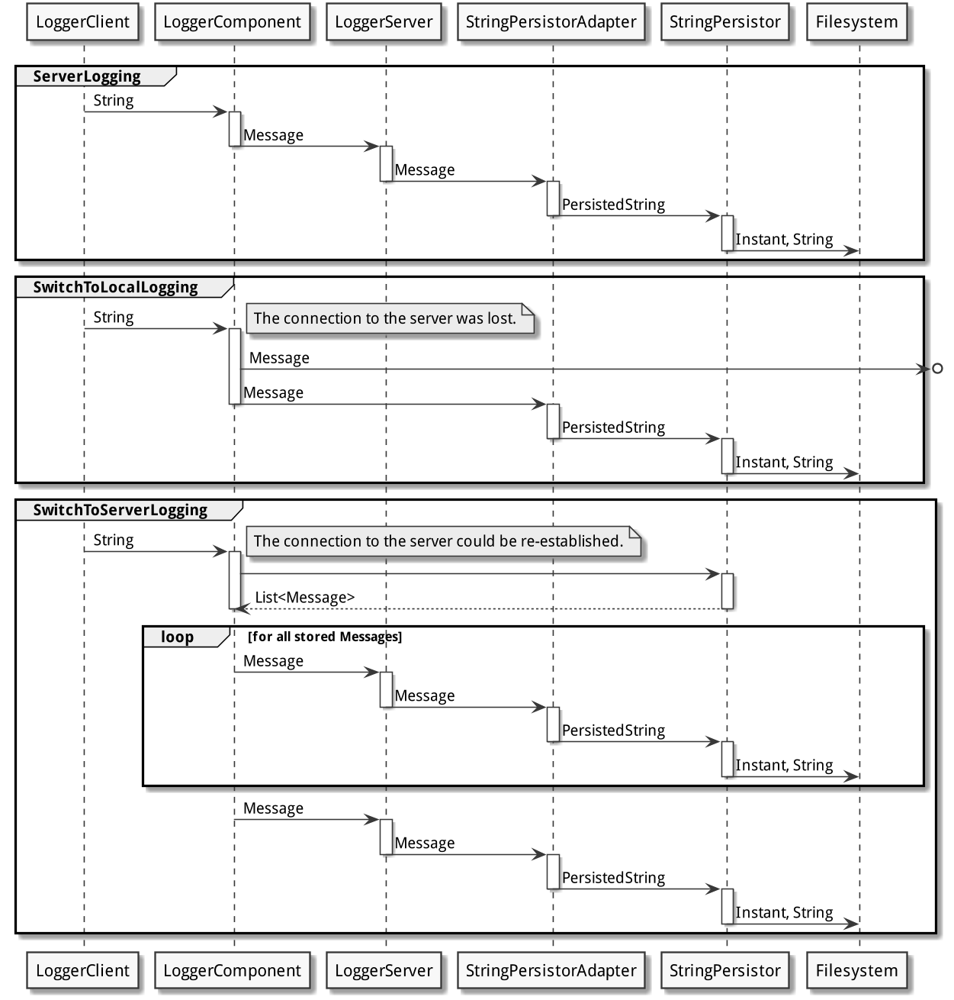

# Protokoll

Die Kommunikationsschnittstelle zwischen `logger-component` und `logger-server` ist mit TCP umgesetzt. Lognachrichten sind als Klasse `Message` (aus dem `logger-common`-Projekt) umgesetzt. Diese Klasse ist beiden Seiten -- Client und Server -- bekannt und serialisierbar. Sie besteht aus drei `String`-Attributen: `level` (`LogLevel.name()`), `source` (Hostname:Portnummer) und `message` (die eigentliche Logmeldung), sowie aus den Timestamps `creationTimestamp` und `serverEntryTimestamp` vom Typ `java.time.Instant`.

Die Client-Server-Kommunikation besteht darin, Instanzen der Klasse `Message` vom Client auf den Server zu übertragen, wo sie mittels `StringPersistor` festgehalten werden.

{width=50%}

## Alternativen

Zwar gibt es mit RMI und HTTP komfortablere und stabilere Protokolle als «blankes» TCP, diese haben aber einen grösseren Overhead und stellen zusätzliche Anforderungen: bei RMI sind dies spezielle Interfaces und Konfigurationen, bei HTTP ist es ein zusätzlicher Webserver, der das entsprechende Protokoll «spricht». Da die Implementierung mittels TCP auf Anhieb und problemlos funktioniert hat, gab es keinen Grund auf ein schwergewichtigeres Protokoll mit entsprechendem Overhead zu wechseln. Das gewählte einfache und leichtgewichtige Protokoll erwies sich bei Lasttests als vorteilhaft.

# Server

Der Server wird mit der Klasse `ConcurrentLoggerServer` (`logger-server`) umgesetzt. Der Port, auf den der Server hören soll, kann per Konstruktor übergeben werden. Derzeit wird er über die Konstante `LOGGING_PORT` mit dem Wert `1234` belegt. (Für mehr Flexibilität könnte diese Einstellung in einer späteren Version auch per Kommandozeilenparameter oder Logdatei gesetzt werden.) Sobald der `ServerSocket` and den jeweiligen Port gebunden ist, nimmt er Verbindungen entgegen.

## Handhabung mehrerer Clients

Für jede eingegangene Verbindung wird ein neuer `ConcurrentClientHandler` erstellt. Diese Klasse implementiert das Interface `Runnable`, sodass jeder Client in einem eigenen Thread bedient werden kann. Der Client-Handler dekoriert den `OutputStream` und den `InputStream` des Client-Sockets mit einem `ObjectOutputStream` bzw. einem `ObjectInputStream`, sodass er Objekte senden und empfangen kann. In der `run()`-Methode werden Objekte in einer Endlosschleife vom Socket entgegengenommen, zu einer `Message` gecastet und über den `StringPersistorAdapter` gespeichert. 

Wird der Socket clientseitig geschlossen, tritt beim Versuch ein Objekt vom Socket zu lesen eine `EOFException` auf. Die `run()`-Methode wird in diesem Fall mittels `return`-Anweisung beendet, sodass der jeweilige Thread endet. Eine Verbindung kann nur clientseitig geschlossen werden.

# Client

Der clientseitige TCP-Code ist in der Klasse `LoggerComponent` umgesetzt. Die Verbindung zum Server wird in der Klasse `LoggerComponentSetup` verwaltet, sodass `LoggerComponent` bei der Instanzierung eine Referenz auf den Socket erhält. (Ändert sich die Konfiguration auf `LoggerComponentSetup`, wird die Verbindung entsprechend neu aufgebaut.) 

`LoggerComponent` implementiert vier verschiedene `log`-Methoden: für eine «blanke» Meldung, für eine formatierte Meldung mit Parametern, für eine Meldung mit `Throwable` und schliesslich für eine Kombination aller erwähnten Elemente. Jede dieser Methoden erstellt aus den gegebenen Parametern eine `Message`-Instanz. Diese wird an die `send`-Methode weitergegeben, welche diese über den `ObjectOutputStream` an den Server schickt.

Die Konfiguration des Clients erfolgt über die Konfigurationsdatei `config.xml`, welche unter anderem die Koordinaten des Servers (Hostname und Portnummer) enthält. (Die Klasse `Logging` im `game`-Projekt kapselt das Auslesen der Konfiguration und die Erstellung der `LoggerComponentSetup`-Instanz.)

## Lokales Logging

Fällt die Verbindung zum Server aus, werden die `Message`-Instanzen zwischenzeitlich lokal geloggt. Dies geschieht direkt über den `StringPersistorAdapter` und nicht per TCP-Schnittstelle. Bei jedem Log-Aufruf wird versucht die Verbindung zum Server wieder aufzunehmen. Funktioniert dies, werden die lokal geloggten Meldungen ausgelesen und über die TCP-Schnittstelle versendet, bevor die neue Logmeldung verschickt wird. Dieser Ablauf wird im [Sequenzdiagramm](#sequenzdiagramm) dargestellt (Sektion `SwtichToServerLogging`).

# Überblick

## Klassendiagramm

{width=90%}

## Sequenzdiagramm {#sequenzdiagramm}

{width=90%}
